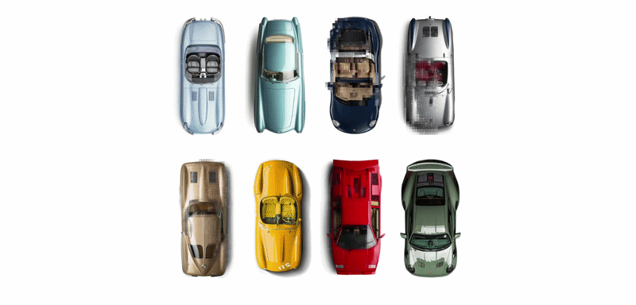

# Glitchy Cars

An ASCII/glitch art piece built with p5.js. Eight top-down car photos are rendered as moving patches of block characters and ASCII text, sampled from each image's pixel brightness. A controller rotates which cars are actively "glitching" versus settling back into a clean reveal, on a 7-second cycle.

## How it works

- Each car gets its own p5.js sketch instance (instance mode), running independently inside a CSS grid.
- A `Glitch` class tracks moving square patches that sample the underlying image and redraw it as block/ASCII characters, with opacity fading in or out depending on the car's current state.
- A simple state machine (`fade` / `progress`, toggled via CSS classes) decides which sketches are actively glitching at any moment, randomized every 7 seconds.

## Running locally

This needs to run from a local server or could be run via [GitHub Pages] ()

1. Clone the repo
2. Open the folder in VS Code
3. Run it with the [Live Server](https://marketplace.visualstudio.com/items?itemName=ritwickdey.LiveServer) extension (or any local static server)
4. Open `index.html` in your browser

## Built with

- [p5.js](https://p5js.org/)
- Images pulled from this [Pinterest board](https://ru.pinterest.com/wolfpulman/cars/)
